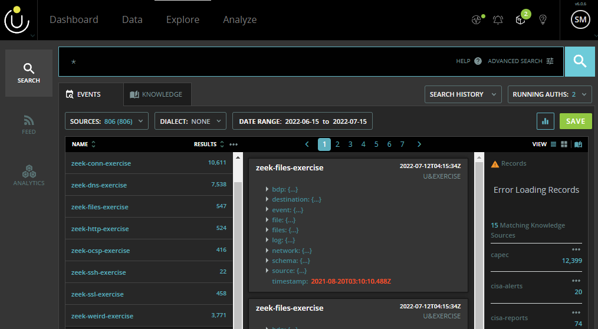

```{r Useful Libraries, include=FALSE}
# Data Manipulation
library(tidyverse)

# Visualization Formatting
library(gridExtra)

# Visualization Font Import
library(sysfonts)
library(showtextdb)
library(showtext)
font_add("LM Roman 10", "./lmroman10-regular.otf")
showtext_auto()
```

\newpage
***
# Part I: Research Question
***

> Can an agglomerative hierarchical clustering analysis of network Zeek logs function as an effective anomaly detection technique?

## Context

  Network Intrusion Detection Systems (NIDS) are installed as physical devices and/or software applications that monitor network traffic patterns to identify malicious activity so that system administrators can take appropriate actions to ensure the integrity and security of their network (Newton & Schoen, 2022).  The two primary methods that NIDS use to classify threats are signature libraries and anomaly detection.  

  Signature libraries are static definition lists that contain digital fingerprints of known exploits; the NIDS identifies and flags network traffic matching the pattern of any threat definition in the signature library.  This method is effective for known exploits, also known as n-day exploits, because the NIDS can effectively label the traffic as malicious and give the systems administrator an indication of how the compromise occurred and what the intended effect may have been.  However, signature libraries are completely ineffective with respect to zero-day exploits; these attacks are either entirely unknown to cybersecurity specialists or are too new to have been fingerprinted sufficiently well to develop a signature-based detection definition.  For these threats, an anomaly-based methodology is more effective.

  Anomaly-based detection methods measure network activity against an established baseline of normal and authorized traffic patterns; any network or user behavior that does not fall within the scope of the baseline is flagged as suspicious and---therefore---a potential indicator of compromise.  These methods are equally effective against n-day exploits and zero-day exploits.

## Justification

  It is sometimes necessary to assess the security status of a network that does not have a NIDS installed or after a period of time during which an installed NIDS was inactive.  In this case, without a system monitoring traffic in real time, a packet capture (PCAP) or alternative network logging system can be leveraged.  While PCAP data is the gold standard for network forensics, the effort and expense required to collect and store every packet of network traffic in its entirety limits this kind of application to very narrow and temporary use cases (Sikos, 2020).  The ability to use a more common and accessible logging standard such as Zeek as an input dataset for an anomaly detection algorithm would be an option that carries significant business value with respect to information assurance, audit compliance, and risk management assessments.

  The contribution of this study to the field of Data Analytics and the MSDA program is to create a clustering model which can identify anomalous network activity from Zeek log data for further investigation by cybersecurity analysts so that potential threats are flagged for remediation before causing significant damage to compromised information systems (The Zeek Project, 2020). This study will use agglomerative hierarchical clustering, an unsupervised machine learning method for data mining, to leverage multiple features of stored Zeek logs in order to create groupings of data points based on their relative similarity in order to isolate any anomalous network activity that merits additional investigation. According to Mazarbhuiya (2019), agglomerative hierarchical clustering is an ideal method to employ for identifying anomalies in the collective attributes of network traffic data which serves as an effective intrusion detection mechanism.

## Hypotheses

  This study will assume the status quo of a network without a functioning NIDS and no PCAP data available.  Namely, the null hypothesis will be that this analysis will not produce any usable information due to the lack of a dedicated monitoring system or full packet capture and storage.  Hence, the alternative hypothesis will be that a clustering analysis of Zeek logs can serve a similar function as a NIDS employing anomaly detection by indicating outliers that merit additional scrutiny from a cybersecurity analyst.

  $H_0$: A hierarchical clustering analysis of Zeek logs cannot reveal anomalous network behavior.

  $H_A$: A hierarchical clustering analysis of Zeek logs can reveal anomalous network behavior.


***
# Part II: Data Collection
***

## Collection Process

  The data needed to address the above defined research question should be Zeek log data collected from a network with a non-trivial number of active users, multiple public-facing hosted services, and—ideally—was compromised during the log collection period.  These attributes ensure that the sample data incorporates multiple types of network traffic and will allow a complete assessment of whether the above defined null hypothesis is accepted or rejected (Zhang, 2010).

  The U.S. Army Cyber Command’s (ARCYBER) Information Integration Division (ID2) maintains Zeek logs for a subset of Department of Defense Information Network (DODIN) systems. Some of this data has been approved for release to defense industry and academic partners for research and development purposes (Brust, 2021).  With that purpose in mind, the ARCYBER Cyber Protection Brigade (CPB) identifies candidate sample data sets while conducting their primary mission of identifying and mitigating real-world network intrusions on real-world networks.  
  
## Advantages and Disadvantages

  This data collection process has the inherent advantage of ensuring the requisite data complexity for this project---including the presence of malicious traffic resulting from that network’s compromise.  Alternatively, one disadvantage of using this technique for data collection is that every aspect of the collection process occurs under the control of a party not directly or indirectly involved with this study.  This means that any desired adjustments to the quantity of data (e.g. date and time ranges available to query) are impossible.  This also means that feature selection for this project will be driven by the Zeek configuration at the site of network compromise as opposed to a custom Zeek configuration optimized for anomaly detection.


***
# Part III: Data Extraction and Preparation
***

## Data Extraction from Gabriel Nimbus

  Access to this data set was secured via a formal request through ID2, coordinating with Gabriel Nimbus (GN) administrators to extract the data from its Hadoop cluster, and arranging the transfer of the extracted data to a DODIN-external server for analysis.  

  Data was queried via the GN portal using a temporary purpose-built account with minimal permissions to prevent access to any sensitive or protected data.  As such, the query “*” was run across the widest date range authorized in order to ensure that all available data was collected.  This data was extracted from the GN Hadoop cluster as a comma separated values (.csv) file and transferred to a private server so that it could be accessed from a non-DODIN system.
  


## Data Preparation

  While it is true that multiple tools are capable of performing agglomerative hierarchical clustering, R will be employed for this task due to its greater diversity of package that are more specifically targeted to narrow applications as compared to Python or SAS (Keells, 2021). Due to being created by statisticians for statistical and data science purposes, R also performs many integral tasks natively and---hence---more simply and quickly than alternative tools (Wickham & Grolemund, 2017).

  The extracted comma separated values file will be loaded into the environment for preparation and subsequent analysis.

```{r Import and Examine Data, message=FALSE, warning=FALSE}
df <- read_csv('./zeek.csv', col_names = TRUE, show_col_types = FALSE)
dim(df)
```
  
  The variables included in the raw data conform to GN unified data model standards and are far larger in number than this project requires. The publicly releasable data set consists of 23,747 observations across 98 features.  This dataset can be subdivided to seven types (or classes) of logs: conn, dns, files, http, ssh, ssl, and weird (The Zeek Project, 2021).  For each class of Zeek log, only a subset of the 98 features are applicable values.  For this reason, whenever a particular log class is examined, the extraneous features should not be considered in order to avoid inserting artificial data sparsity (Shi et al., 2021).

  
```{r Define Connectivity Columns, include=FALSE}
conn.columns <- c("ID", "Visibility", "timestamp", "bdp.ingest.file.name",
                  "bdp.ingest.parser.name", "connection.local_orig",
                  "connection.local_resp", "destination.as.nunber",
                  "destination.bytes", "destination.geo.ccmd",
                  "destination.geo.country_name", "destination.geo.location.lat",
                  "destination.geo.location.lon", "destination.ip",
                  "destination.ip_bytes", "destination.packets", "destination.port",
                  "event.category", "event.duration", "event.id", "event.ingested",
                  "network.connection.history", "network.connection.state",
                  "network.direction", "network.missed_bytes", "network.protocol",
                  "network.transport", "schema.mapping_version", "schema.version",
                  "source.bytes", "source.ip", "source.ip_bytes", "source.packets",
                  "source.port")
```


```{r Subset Connectivity Logs}
df.conn <- df %>% 
            filter(bdp.ingest.file.name == "conn.log") %>%
            select(all_of(conn.columns))
```
  
  The quality of the data is very high as the Zeek logs selected for study are intended to be used for forensic analysis applications by cybersecurity professionals. Overall sparsity within the selected log class (conn) is 12.4%.

```{r Connectivity Sparsity, cache=TRUE, echo=FALSE, message=FALSE, warning=FALSE, fig.showtext=TRUE}
library(visdat)
vis_dat(df.conn, warn_large_data = FALSE) +
                      labs(title = "Connectivity Logs Sparsity", caption ="Figure 2") +
                      theme(text = element_text(family = "LM Roman 10"))
```
  
  This agglomerative clustering project will focus on a select few features from the conn logs; specifically, this project will examine all 10,726 observations available in the conn logs across 4 specific features: destination.packets, destination.port, source.packets, and source.port.

```{r Subset Selected Features}
df.conn.cut <- df.conn %>% 
  select(destination.packets, destination.port, source.packets, source.port)
```
  
  Data sparsity within the four selected features for analysis (destination.packets, destination.port, source.packets, and source.port) is 0%. Having a very low sparsity for the data is important as outlier detection could be skewed by missing values (Shi et al., 2021).

  After reducing the original dataset down to the four chosen variables, a scaled version of the data will be created due to the differences in the ranges of the variables (Pamula et al., 2010). 

```{r Conn Scaling}
df.conn.scaled <- as.data.frame(scale(df.conn.cut))
```

  Outliers are frequently removed for traditional clustering analyses; however, they will not be removed for this project because the desired outcome in this case relies on the existence of correlations among the outliers that might identify threat actors’ actions within the monitored network (Mazarbhuiya, 2019).  As such, no further action will be taken to clean or prepare the data for analysis.


\newpage
***
# Part IV: Analysis
***

## Distance Matrix

  Having prepared the data for analysis, a distance (or dissimilarity) matrix will be calculated in order to compare four common linkage methods.  The data was scaled to have a mean of 0 and a standard deviation of 1 during pre-processing, so we will use a Euclidean distance calculation. 

```{r Dissimilarity Matrix Calculation}
df.conn.dist <- dist(df.conn.scaled, method = "euclidean")
```

## Agglomerative Coeffecients

  The agglomerative coefficient (AC) of four common linkage methods---complete, average, single, and ward's method---will be calculated and compared in order to determine which will be used for this project's analysis. The agglomerative coefficient conveys a sense of how defined the clustering structure is within a given data set.  AC values closer to 1 suggest a more clearly defined structure, and less clearly defined structres exhibit lower AC values.
  
```{r Compute Agglomerative Coefficient, cache = TRUE}
library(cluster)
set.seed(214)

hc.complete <- agnes(df.conn.dist, method = "complete")
hc.average  <- agnes(df.conn.dist, method = "average")
hc.single   <- agnes(df.conn.dist, method = "single")
hc.ward     <- agnes(df.conn.dist, method = "ward")
```

| Average          | Single           | Complete          | Ward’s         |
|------------------|------------------|-------------------|----------------|
|`r hc.average$ac` |`r  hc.single$ac` |`r  hc.complete$ac`| `r  hc.ward$ac`|

  We can see above that each of the calculated linkage methods produce values within .0001 of 1.  This indicates a statistically significant clustering structure within the data regardless of the linkage method chosen. Ward's method will be employed for the remainder of this project due to being closer to 1 than its alternatives.

## Number of Clusters

  Traditionally, clustering analyses include a discussion of the dendrogram to show the clustering process.  This visualization can help to discern the optimal number of clusters and increase confidence in the chosen linkage method where the dendrogram does not show anomalous behavior itself (e.g. dendrogram inversion).


```{r Determine Number of Clusters, echo=FALSE, fig.height=3, cache=TRUE, fig.showtext=TRUE}
library(factoextra)

elbow      <- fviz_nbclust(df.conn.scaled, FUN = hcut, 
                      method = "wss", k.max = 10) +
                      labs(title = "Elbow Method", caption = "Figure 3") +
                      theme_light() +
                      theme(text = element_text(family = "LM Roman 10"))

silhouette <- fviz_nbclust(df.conn.scaled, FUN = hcut, 
                      method = "silhouette", k.max = 10) +
                      labs(title = "Silhouette Method", caption = "Figure 4") +
                      theme_light() +
                      theme(text = element_text(family = "LM Roman 10"))

gridExtra::grid.arrange(elbow, silhouette, nrow = 1)
```

  The elbow plot is largely inconclusive; there is no significant bend that might indicate an optimal cluster count.  The silhouette statistic plot, however, is conclusivel it indicates that a two-cluster solution is optimal for this data set. 
  
  The project will proceed with two clusters. The choice---in this case---is supported by examining the silhouette statistic, which would be consistent with the approach for any normal hierarchical clustering analysis.  However, even if this approach were not conclusive, a two-cluster approach would still be the proper way forward for the intended application of this analysis.  Network traffic is either normal or abnormal.  While there may be several classes of normal (or abnormal) traffic, the desired outcome for the scope of this study that traffic that is the least similar to the majority of baseline traffic is flagged for human analysis.

## Cluster Membership

  Below is a cluster plot showing the relative differences and similarities of grouped network traffic.  Given network data, this visualization is most effective at determining optimal number of clusters and imparting a sense of the relative disimilarity of the detected outliers.
  
```{r Two-Cluster Membership, echo=FALSE, cache=TRUE, fig.showtext=TRUE, fig.height=3}
clust.2 <- cutree(hc.ward, k = 2)

fviz_cluster(list(data = df.conn.scaled, cluster = clust.2), geom = "point",
             font.family = "LM Roman 10") +
  labs(title = "Two-Cluster Observation Membership Plot", 
  y=NULL, x=NULL, caption = "Figure 5") +
  annotate("text", x = -4, y = -35, label = "Anomalous Network Traffic") +
  annotate("text", x = -7.5, y = -4.5, label = "Normal Network Traffic") +
  theme_light() +
  theme(text = element_text(family = "LM Roman 10"))
```

## Silhouette Values

  The silhouette values will be produced to assess the objective quality of the clusters and the resulting outliers will be forwarded to the cybersecurity analysts for further review. 

```{r Define Cut, cache=TRUE, include=FALSE}
library(factoextra)
hc.cut <- hcut(df.conn.scaled, k = 2, hc_method = "ward.D2")
```

```{r Silhouette Score, echo=FALSE, fig.height=3, fig.showtext=TRUE, cache=TRUE}
fviz_silhouette(hc.cut, k=2, label = FALSE, print.summary = FALSE) +
  labs(title = "Cluster Silhouette Plot", y=NULL, x=NULL,
  subtitle = "Average Silhouette Width: 0.98",
  caption = "Figure 6") +
  theme_light() +
  theme(text = element_text(family = "LM Roman 10"))
```


```{r Cut Tree and Count Groups, cache = TRUE }
table(clust.2)
```

## Advantage and Disadvantage

### Advantage: Network Defined Normal

  Due to how an agglomerative hierarchical clustering algorithm functions, each application of this method will use the traffic patterns of the analyzed network to establish appropriate thresholds for outlier definitions.  This means that the approach could be applied with very similar workflows across various industries and network topographies.  Much like the appeal of anomaly detection vice signature matching, this unsupervised data mining approach to forensic network analysis generalizes very well. 
  
### Disadvantage: Class Imbalance

  Like money laundering, network traffic that is indicative of compromise is vastly outnumbered by legitimate traffic.


```{r Plot Dendrogram, echo=FALSE, message=FALSE, warning=FALSE, cache=TRUE, fig.height=3}
library(factoextra)
fviz_dend(hc.cut, cex = 0.5, k = 2, color_labels_by_k = TRUE, show_labels = FALSE) +
  labs(title = "Complete Dendrogram", y=NULL, x=NULL, caption = "Figure 7") +
  theme_light() +
  theme(text = element_text(family = "LM Roman 10"))
```
 
 
***
# Part V: Summary and Implications
***

## Analysis Results

  The goal of this project was to separate the Zeek log data into multiple 	clusters that group legitimate network traffic types together and isolate anomalous traffic that might indicate a compromise of the network.  The agglomerative coefficients produced by multiple linkage methods were greater than 0.9 and the average silhouette width for our final clustering model was also greater than 0.9.  The smallest cluster contained three observations (0.02% of total observations) and a silhouette width of greater than 0.99.  These results lead necessitate a rejection of the null hypothesis that an agglomerative hierarchical clustering analysis cannot reveal anomalous network behavior.  Similarly, this study’s results necessitate an affirmative response to the research question of whether an agglomerative hierarchical clustering analysis of network Zeek logs can function as an effective anomaly detection technique. 

## Analysis Limitation

  Anomaly detection---while a valuable part of the threat identification process---is not equivalent to threat identification on its own.  It is true that legitimate network traffic can be anomalous.  For example, an authorized systems administrator installs an approved new program that establishes verification and activation telemetry with a licensing server. That kind of traffic will likely use atypical ports and contain unusual packet bursts that would be flagged (correctly) as anomalous; however, it would not be an indicator of compromise.

  Within the defined scope of this project, the anomalies are not necessarily assessed for maliciousness.  For this reason, the structure of the analysis calls for the forwarding of flagged traffic to cybersecurity specialists for further analysis. 

## Course of Action Recommendation

  In a circumstance where it is not possible or otherwise impractical to leverage the real-time scanning of a NIDS, a network administrator may still want to assess the security state of a network with available log data. Rather than be required to sift through the entirety of large amounts of traffic or apply domain knowledge to a very large dataset, it may be desired to narrow the scope of data that a human specialist should examine such that the bulk of benign traffic does not have to be considered. 

  For this scenario, it is recommended that an agglomerative hierarchical clustering technique be applied to the overall count and port information from both the source and destination of packets from the network’s connectivity Zeek logs.  This study found that using Ward’s method criterion was the ideal linkage method.  A silhouette statistic graph can be used to determine the theoretically optimal number of clusters; however, a two-cluster solution will best separate the typical network traffic from the traffic that least conforms to the norms of the tested environment.  Upon completion of the agglomerative clustering analysis, the traffic flagged as outliers should be forwarded to the relevant cybersecurity specialists for manual review.

## Approaches for Further Study

  The results of this study indicate a successful proof-of-concept for a specific machine learning enabled security analysis method where real-time network monitoring is not possible.  However, the method demonstrated here can likely be improved or otherwise optimized for simpler or more reliable implementation.

### Feature Combinations

  Despite experimenting with a multitude of variable combinations while conducting this study, the set of tested feature combinations is far from exhaustive.  This scope of the findings of this project do not claim certainty that an alternative feature selection would not produce more significant or more directly useful clusters.  Additional research should be conducted with varying features from the connectivity logs or from other Zeek log classes.  Particular attention should be focused on increasing the separation of the outliers from legitimate network traffic while keeping the authorized traffic from being flagged as a false positive. 

### Threat Ranking

  This approach requires a cybersecurity analyst to examine each of the outliers identified as potential evidence of the presence of a threat actor within their network.  A further avenue of study could be to run a similar agglomerative hierarchical clustering algorithm on a larger number of other data sets, group all the identified outliers, label the data as benign or malicious, and then attempt to train a secondary algorithm to prioritize the flagged outliers according to their relative likelihood of being an actual indicator of network compromise.


  

\newpage
# References
\  

Brust, A. (2021). Army hopes Big Data Platform enables deeper analysis across bigger datasets. Federal News Network. Retrieved July 12, 2022, from https://federalnewsnetwork.com/technology-main/2021/08/army-hopes-big-data-platform-enables-deeper-analysis-across-bigger-datasets/ 

Keells, J. (2021, July 9). Python vs R for data science. Medium. Retrieved July 12, 2022, from https://medium.com/octave-john-keells-group/python-vs-r-for-data-science-320e167ffe90 

Newton, H., & Schoen, S. (2022). Newton’s Telecom Dictionary (32nd ed.). Telecom Publishing.

Mazarbhuiya, F.A., AlZahrani, M.Y., Georgieva, L. (2019). Anomaly Detection Using Agglomerative Hierarchical Clustering Algorithm. In: Kim, K., Baek, N. (eds) Information Science and Applications 2018. ICISA 2018. Lecture Notes in Electrical Engineering, vol 514. Springer, Singapore. https://doi.org/10.1007/978-981-13-1056-0_48 

Pamula, R., Deka J. K., Nandi, S. (2011). An Outlier Detection Method Based on Clustering, Second International Conference on Emerging Applications of Information Technology, 2011, pp. 253-256, doi: 10.1109/EAIT.2011.25. 

Shi, P., Zhao, Z., Zhong, H., Shen, H., & Ding, L. (2021). An improved agglomerative hierarchical clustering anomaly detection method for scientific data. Concurrency and Computation: Practice and Experience, 33. 

The Zeek Project. (2020). The Zeek Network Security Monitor. https://zeek.org/   

The Zeek Project. (2021). conn.log — Book of Zeek (git/master). Zeek Logs Official Documentation. Retrieved July 12, 2022, from https://docs.zeek.org/en/master/logs/conn.html

Wickham, H., & Grolemund, G. (2017). R for Data Science. Sebastopol, CA: O’Reilly. https://r4ds.had.co.nz/ 

Zhang, Y., Liu, J., Li, H. (2010). An Outlier Detection Algorithm Based on Clustering Analysis. First International Conference on Pervasive Computing, Signal Processing and Applications, 2010, pp. 1126-1128, doi: 10.1109/PCSPA.2010.277.

Zhang, Y., Liu, J., Zheng, L., & Yan, C. (2019) A Hierarchical Clustering Strategy of Processing Class Imbalance and Its Application in Fraud Detection. IEEE 21st International Conference on High Performance Computing and Communications. IEEE 17th International Conference on Smart City; IEEE 5th International Conference on Data Science and Systems (HPCC/SmartCity/DSS). https://doi.org/10.1109/HPCC/SmartCity/DSS.2019.00249
 